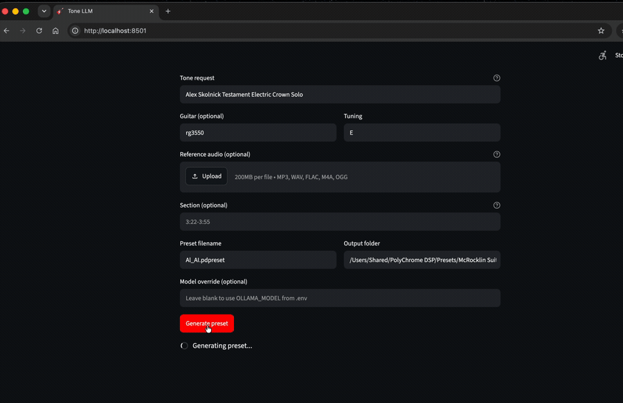

# Tone LLM (`tonellm`)

Generate guitar effect presets from a text description, optionally grounded by a reference recording. Tone LLM uses an LLM to interpret your request plus a deterministic translator to write plugin-specific preset files.

<p align="center">
  
</p>

---

## What it does

- **Text-to-preset** — describe an artist, song, and part; get a loadable preset back.
- **Reference-audio grounding** — drop a reference MP3/WAV so the LLM can match measured audio features.
- **Solo isolation** — analyze only a time range of a full mix, useful for leads.
- **Sidecar workflow** — every run writes a `.tone.json` descriptor; edit it and rebuild the preset without another LLM call.
- **Web UI and CLI** — use whichever fits your workflow.

Currently ships with [Polychrome DSP](https://www.michaelmcrocklin.com/polychrome-dsp) support. Mappings for additional plugin ecosystems are in progress.

---

## Quick start

Uses [uv](https://docs.astral.sh/uv/) (Python 3.11+ per `pyproject.toml`).

```bash
curl -LsSf https://astral.sh/uv/install.sh | sh
uv venv --python 3.11
source .venv/bin/activate
uv pip install -e ".[ui]"
```

Create a `.env` in the project root. The example below uses Ollama; use whichever LLM provider you prefer.

```env
OLLAMA_API_KEY=your_key_here
OLLAMA_HOST=https://ollama.com
OLLAMA_MODEL=deepseek-v4-pro
```

### Private tone assets (open-core model)

This repo contains the framework, UI, CLI, and preset translator. The tone-engineering knowledge — system prompt and plugin mappings — is loaded from private files outside the repository.

Create these files:

- `~/.config/tonellm/prompts/tone_system.md` — the LLM system prompt
- `~/.config/tonellm/mappings.json` — cab/amp/delay/reverb slot mappings

Or point to them with environment variables:

```env
TONELLM_SYSTEM_PROMPT=/path/to/tone_system.md
TONELLM_MAPPINGS=/path/to/mappings.json
```

See [`examples/private_assets/`](examples/private_assets/) for the expected shape.

Launch the web UI:

```bash
tonellm ui
```

Open [http://localhost:8501](http://localhost:8501), enter a tone request, optionally upload a reference, set a section range, and download the preset + sidecar.

---

## Project layout

```
tonellm/
├── src/tonellm/           # Core framework and translator
│   ├── cli.py             # Typer CLI entry point
│   ├── ui.py              # Streamlit web interface
│   ├── service.py         # High-level generate/translate service
│   ├── llm.py             # LLM prompt handling
│   ├── audio.py           # Reference-audio feature extraction
│   ├── descriptor.py      # ToneDescriptor schema
│   ├── polychrome.py      # Polychrome DSP preset writer
│   └── private_assets.py  # Resolve private system prompt / mappings
├── assets/                # Demo GIF and screenshots
├── examples/private_assets/
│   ├── tone_system.md     # Example system prompt shape
│   ├── mappings.json      # Example plugin mapping shape
│   └── README.md          # How to install private assets
├── pyproject.toml         # Package metadata and dependencies
├── LICENSE                # MIT License
└── README.md              # This file
```

---

## Usage examples

### Text only

```bash
tonellm tone "George Harrison All Things Must Pass rhythm" \
    -guitar rg3550 \
    -tuning E \
    -out "/Users/Shared/PolyChrome DSP/Presets/McRocklin Suite/User/George.pdpreset"
```

### With reference audio

```bash
tonellm tone "Alex Skolnick Testament So Many Lies lead" \
    -guitar rg3550 -tuning E \
    -ref ./lies.mp3 \
    -out "/Users/Shared/PolyChrome DSP/Presets/McRocklin Suite/User/Skolnick_Lies.pdpreset"
```

### Isolate a solo from a full mix

Use `-section` to analyze only the guitar part. Accepts seconds (`90-130`) or `mm:ss` (`3:22-3:55`).

```bash
tonellm tone "Alex Skolnick Testament So Many Lies lead" \
    -guitar rg3550 -tuning E \
    -ref ./lies.mp3 -section 3:22-3:55 \
    -out "/Users/Shared/PolyChrome DSP/Presets/McRocklin Suite/User/Skolnick_Lies.pdpreset"
```

### Re-translate a sidecar by hand

Edit the `.tone.json` sidecar, then rebuild the preset without another LLM call:

```bash
tonellm from-descriptor RunRiot.tone.json \
    -out "/Users/Shared/PolyChrome DSP/Presets/McRocklin Suite/User/RunRiot_v2.pdpreset"
```

### Load in Polychrome

1. Open Polychrome DSP.
2. Click the preset arrow and find your preset in the User folder.
3. Load and audition.

Each run writes a `.tone.json` sidecar next to the preset. Use it to audit what the LLM decided, tweak values, and re-translate.

---

## Technology stack

- **Python 3.11+** for the framework
- **Pydantic** for the tone descriptor schema
- **Typer** for the CLI
- **Streamlit** for the web UI
- **librosa / numba / scipy** for reference-audio analysis
- **Ollama / OpenAI-compatible LLM providers** for text interpretation
- **Polychrome DSP** as the first supported preset target

---

## System requirements

- Python 3.11 or newer
- `uv` for environment and package management
- A running LLM endpoint (Ollama, OpenAI-compatible API, etc.)
- Optional: reference audio files for audio-grounded generation

---

## Web interface

After installing with the `ui` extra:

```bash
tonellm ui
```

The UI runs at `http://localhost:8501`. It supports tone requests, reference-audio upload, section-range selection, output-folder picker, and preset/sidecar download.

Use a custom port:

```bash
tonellm ui -port 8502
```

---

## Contributing

Contributions are welcome. This started as a personal tool, so there is plenty of room to improve.

- The cab/amp/delay/reverb mappings are loaded from a private `mappings.json`. If you have corrections, open an issue.
- The era cheat sheets and guitar compensations in the private system prompt can always be sharpened.
- New amps, cabs, pedals, or plugin targets can be added to the public `ToneDescriptor` model and translator.

Open an issue to discuss bigger changes, or send a PR for focused fixes. Run `uv run pytest` before submitting.

---

## License

[MIT](LICENSE) © Vishwanath Subramanian

---

## About

Tone LLM was built to turn text and reference recordings into usable guitar tones without menu diving. It is part of the VToneLab project.

More samples and walkthroughs on YouTube: [youtube.com/@vtonelab](https://www.youtube.com/@vtonelab)
